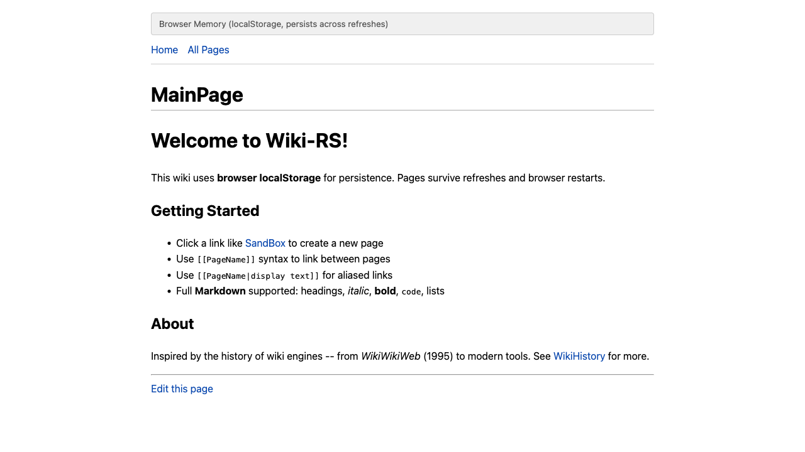
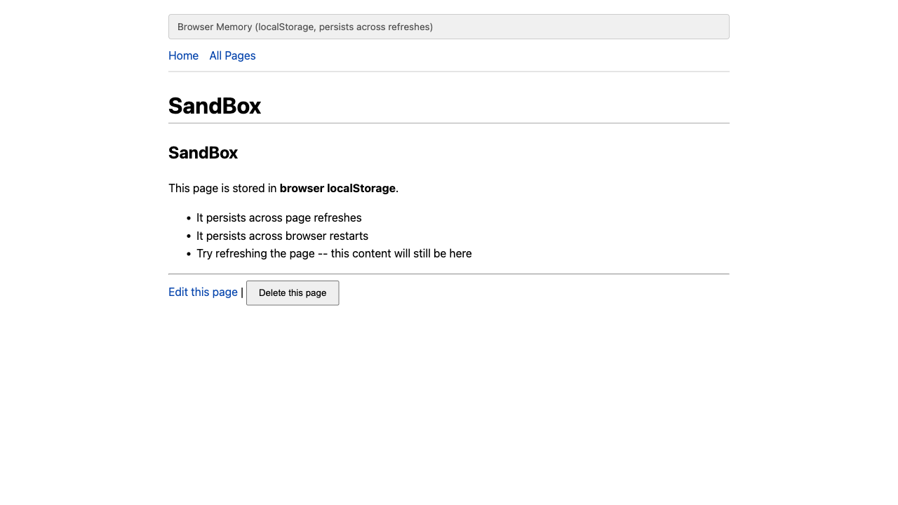
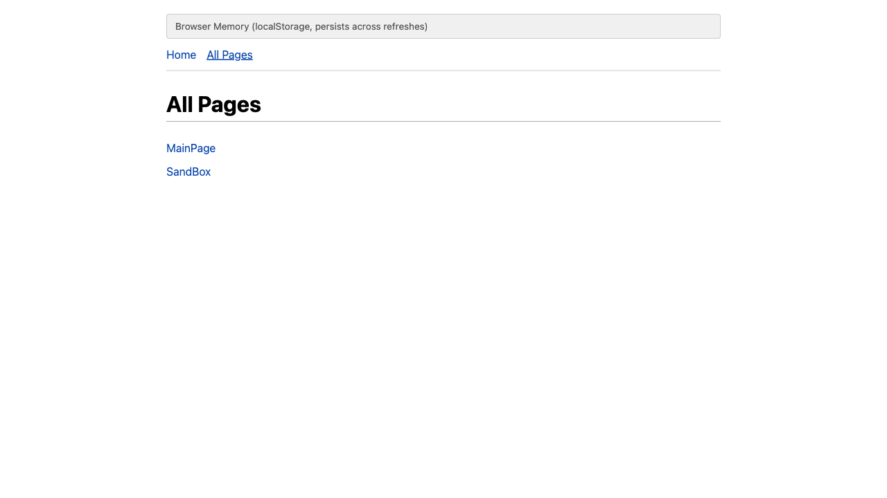

# Wiki-RS: Browser Memory (localStorage)

**Port:** 7409
**Storage:** Browser localStorage
**Persistence:** Survives page refreshes and browser restarts

## Overview

The browser-memory wiki uses the Web Storage API (`localStorage`) to persist
all wiki pages as a JSON-serialized HashMap. Pages survive page refreshes,
tab closes, and even browser restarts.

This approach mirrors the TiddlyWiki (2004) philosophy of keeping the entire
wiki in the browser, though TiddlyWiki used a single HTML file rather than
localStorage.

## Running

```bash
cd crates/wiki-browser-memory
trunk serve
# Open http://127.0.0.1:7409/
```

## Screenshots

### Main Page

The banner indicates localStorage persistence. Wiki links to nonexistent
pages appear in red.



### Created Page

Pages created here persist across refreshes -- try reloading the browser
to verify.



### All Pages

The page index shows all wiki pages stored in localStorage.



## Architecture

- **Crate:** `wiki-browser-memory`
- **Storage impl:** `BrowserMemoryStorage` in `src/storage.rs`
- **Persistence:** `gloo::storage::LocalStorage` (Web Storage API)
- **Shared UI:** `wiki-ui` crate
- **Shared types:** `wiki-common` crate

## Storage Details

Pages are serialized as JSON into a single localStorage key (`wiki-rs-pages`).
Every `save_page` and `delete_page` call triggers a full re-serialization
to localStorage.

## Limitations

- Storage limited by browser localStorage quota (typically 5-10 MB)
- No way to transfer pages between browsers or devices
- Single-origin only (different ports = different storage)
- No versioning or history
