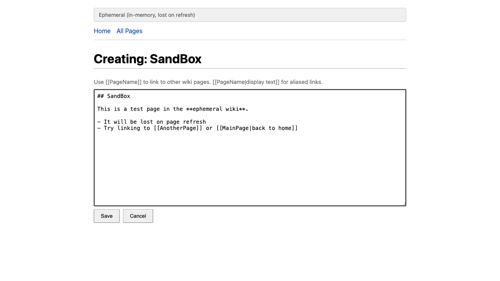
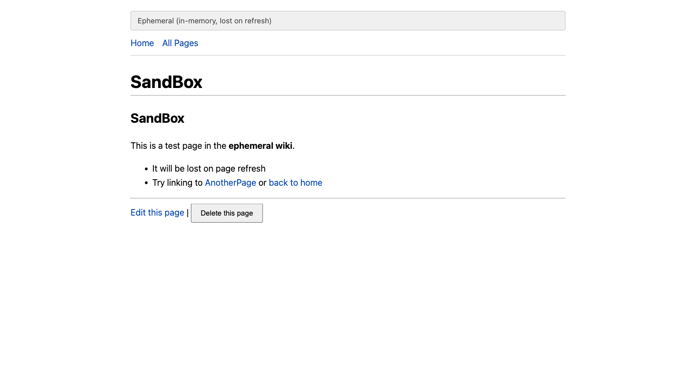
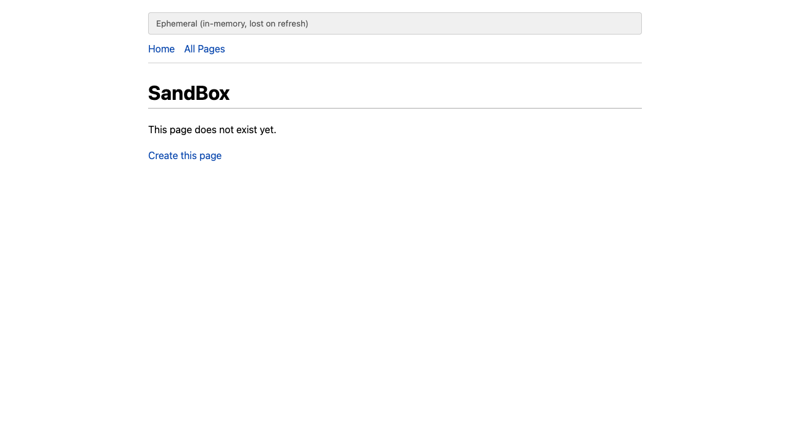

# Wiki-RS: Ephemeral (In-Memory)

**Port:** 7408
**Storage:** In-memory HashMap
**Persistence:** None -- all pages lost on page refresh

## Overview

The ephemeral wiki stores all pages in a Rust `HashMap` wrapped in `RefCell`.
This is the simplest possible storage backend and is useful for quick demos
or experimentation where persistence is not needed.

Inspired by the earliest wiki engines like WikiWikiWeb (1995), which used
simple in-memory or flat-file storage with no database layer.

## Running

```bash
cd crates/wiki-ephemeral
trunk serve
# Open http://127.0.0.1:7408/
```

## Screenshots

### Main Page

The landing page shows Markdown-rendered content with wiki links.
Red links indicate pages that do not exist yet.


### Nonexistent Page

Clicking a red wiki link navigates to the missing page with a
"Create this page" prompt -- the classic wiki creation flow.



### Editing a Page

The editor supports wiki link syntax (`[[PageName]]`) and full Markdown.



### Saved Page

After saving, the page renders with Markdown formatting and wiki links.
Existing links appear blue; missing links appear red.



## Architecture

- **Crate:** `wiki-ephemeral`
- **Storage impl:** `EphemeralStorage` in `src/main.rs`
- **Shared UI:** `wiki-ui` crate (components, routing, context)
- **Shared types:** `wiki-common` crate (WikiPage, parser, WikiStorage trait)

## Limitations

- All data is lost on page refresh or browser tab close
- No export or import capability
- Single-user, single-tab only
