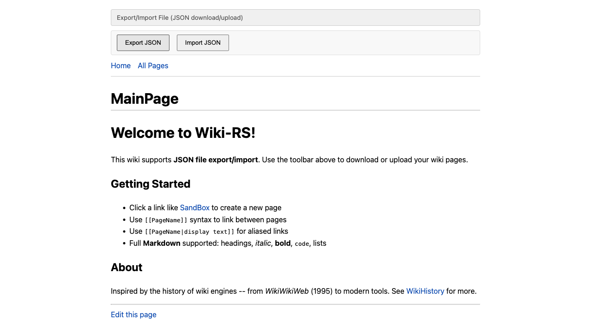
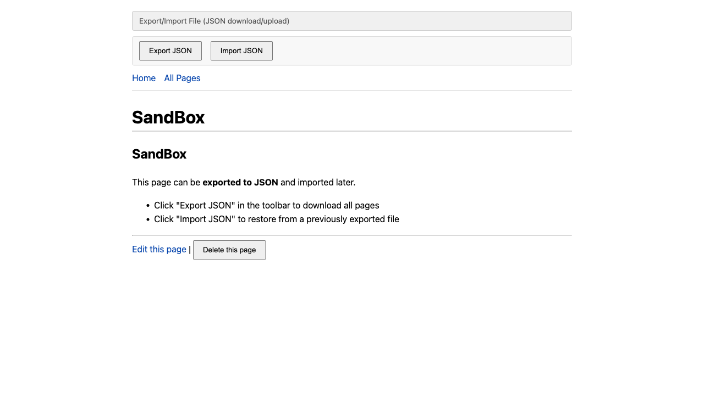
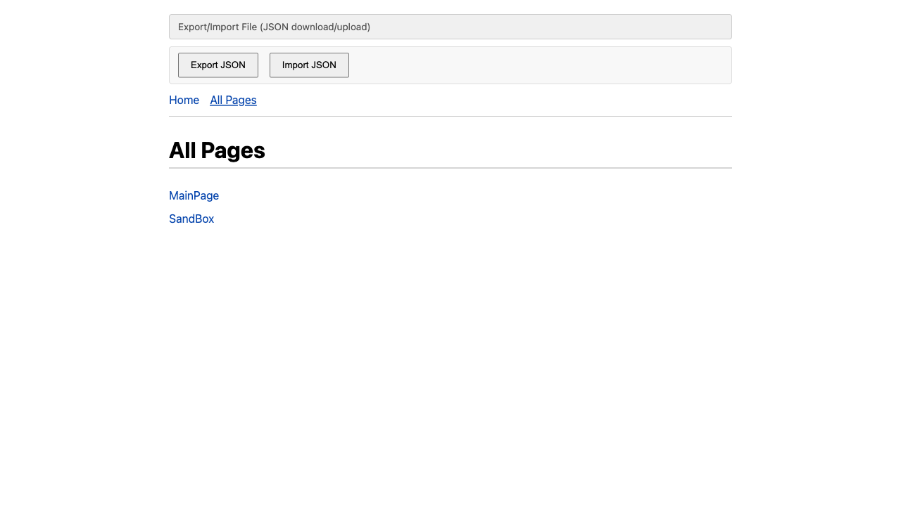

# Wiki-RS: Export/Import File (JSON)

**Port:** 7407
**Storage:** In-memory with JSON file download/upload
**Persistence:** Manual -- user exports to file, imports to restore

## Overview

The export-file wiki runs in-memory like the ephemeral variant, but adds
a toolbar for downloading all pages as a JSON file and uploading a
previously exported file to restore content.

This approach is inspired by TiddlyWiki's single-file portability and the
early wiki practice of backing up content as flat files that could be
moved between systems.

## Running

```bash
cd crates/wiki-export-file
trunk serve
# Open http://127.0.0.1:7407/
```

## Screenshots

### Main Page with Toolbar

The Export/Import toolbar appears above the navigation. "Export JSON"
downloads all pages; "Import JSON" uploads a previously exported file.



### Created Page

Pages are created using the same wiki link flow. The toolbar remains
available on every page.



### All Pages

The page index shows all pages currently in memory.



## Architecture

- **Crate:** `wiki-export-file`
- **Storage impl:** `ExportFileStorage` in `src/storage.rs`
- **Toolbar:** `ExportImportToolbar` component in `src/toolbar.rs`
- **Export format:** Pretty-printed JSON array of `WikiPage` objects
- **Shared UI:** `wiki-ui` crate
- **Shared types:** `wiki-common` crate

## Export Format

The exported JSON file contains an array of wiki pages:

```json
[
  {
    "title": "MainPage",
    "content": "# Welcome to Wiki-RS!\n\n..."
  },
  {
    "title": "SandBox",
    "content": "## SandBox\n\n..."
  }
]
```

## Limitations

- Pages are lost on refresh unless exported first
- Import merges pages (does not clear existing pages)
- No automatic save -- user must manually export
- No versioning or diff between exports
